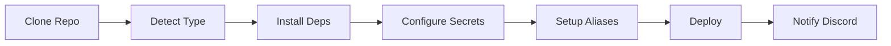

# Universal Project Bootstrapper

> One command to rule them all - Automate project setup, dependency installation, secret management, and deployment.

## 🎯 Overview

The Universal Project Bootstrapper is a powerful automation tool that transforms complex deployment workflows into a single command. It handles everything from cloning repositories to configuring secrets and deploying applications.

## ✨ Features

- **One-Command Deployment**: Bootstrap entire projects with a single command
- **Smart Detection**: Automatically detects project type (Spring Boot, Node.js, Python, etc.)
- **Dependency Management**: Installs Docker, runtimes, and system dependencies automatically
- **Secret Management**: Integrates with 1Password for secure, automated secret configuration
- **Global Aliases**: Configures convenient shell aliases (`deploy`, `logs`, `status`)
- **Discord Notifications**: Real-time deployment notifications with rich embeds
- **Auto-Deploy**: Webhook support for automatic deployment on git push
- **Multi-Project**: Manage multiple projects on the same server

## 🚀 Quick Start

### One-Command Installation (Recommended)

The fastest and most professional way - like Docker, Homebrew, or Rust:

```bash
# Install + Bootstrap your project in one command
curl -sSL https://raw.githubusercontent.com/YOUR_USERNAME/bootstrap/main/quick-install.sh | \
  sudo bash -s dynamoss --env=prod

# Or just install the bootstrapper
curl -sSL https://raw.githubusercontent.com/YOUR_USERNAME/bootstrap/main/quick-install.sh | sudo bash
```

### Manual Installation

```bash
# Install the bootstrapper
curl -sSL https://bootstrap.ihabfallahy.dev/install | bash
```

### Basic Usage

```bash
# Bootstrap a project (simplest form)
bootstrap dynamoss

# With environment specification
bootstrap dynamoss --env=prod

# With custom vault
bootstrap dynamoss --vault="my-vault" --env=dev
```

That's it! The bootstrapper will:
1. ✅ Clone the repository
2. ✅ Detect project type and requirements
3. ✅ Install all dependencies
4. ✅ Configure secrets from 1Password
5. ✅ Setup convenient aliases
6. ✅ Deploy the application
7. ✅ Notify Discord (if configured)

## 📖 Documentation

- **[Usage Guide](docs/USAGE.md)** - Detailed usage instructions and examples
- **[Adding Projects](docs/ADDING_PROJECTS.md)** - How to make your project compatible
- **[Architecture](docs/ARCHITECTURE.md)** - System design and components
- **[1Password Setup](docs/1PASSWORD_SETUP.md)** - Configure 1Password integration
- **[Troubleshooting](docs/TROUBLESHOOTING.md)** - Common issues and solutions

## 🏗️ Project Structure

```
bootstrap/
├── bootstrap.sh              # Main orchestrator
├── lib/                      # Core libraries
│   ├── common.sh            # Shared utilities
│   ├── detect.sh            # Project detection
│   ├── install.sh           # Dependency installation
│   ├── git.sh               # Git operations
│   ├── secrets.sh           # 1Password integration
│   ├── aliases.sh           # Shell alias management
│   ├── discord.sh           # Discord notifications
│   └── webhook-server.sh    # Webhook receiver
├── templates/               # Project templates
│   ├── spring-boot/
│   ├── nodejs/
│   ├── python/
│   └── generic/
└── docs/                    # Documentation
```

## 🎨 Templates

The bootstrapper includes templates for common project types:

- **Spring Boot**: Java applications with Maven/Gradle
- **Node.js**: JavaScript/TypeScript applications
- **Python**: Python applications with pip/poetry
- **Generic**: Minimal template for custom projects

## 🔐 Security

- Secrets are never logged or exposed in console output
- `.env` files are created with `600` permissions
- 1Password integration uses encrypted sessions
- Webhook signatures are cryptographically validated
- Service account support for CI/CD environments

## 🛠️ Requirements

- **OS**: Linux (Ubuntu, Debian, CentOS, Fedora)
- **Tools**: bash, curl, git (installed automatically if missing)
- **Optional**: 1Password CLI (for secret management)

## 💡 Examples

### Production Deployment
```bash
bootstrap dynamoss --env=prod --vault="dynamoss-prod"
```

### Development Setup
```bash
bootstrap my-api --env=dev --dir=/home/user/projects/my-api
```

### CI/CD Integration
```bash
# GitHub Actions / GitLab CI
bootstrap ${{ github.repository }} --non-interactive --env=staging
```

### Multi-Project Server
```bash
bootstrap project-a --dir=/opt/project-a
bootstrap project-b --dir=/opt/project-b
# Each gets its own aliases: project-a-deploy, project-b-deploy
```

## 🔄 Workflow



## 🤝 Contributing

Contributions are welcome! To add support for a new project type:

1. Create a template in `templates/your-type/`
2. Add detection logic in `lib/detect.sh`
3. Document the template
4. Test thoroughly

## 📝 License

MIT License - See LICENSE file for details

## 🙏 Acknowledgments

Inspired by modern DevOps practices and the need for simple, repeatable deployments.

---

**Made with ❤️ for developers who value automation**
