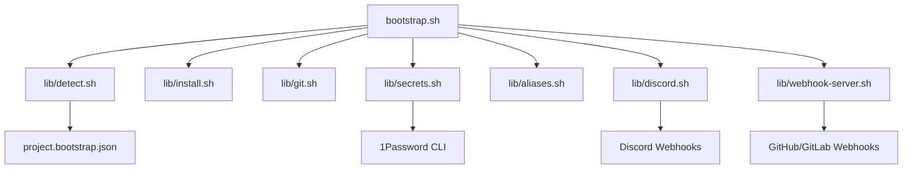

# System Architecture

The Universal Project Bootstrapper is designed as a modular system composed of a main orchestrator script and specialized library components.

## Component Diagram

## Core Components

### 1. Orchestrator (`bootstrap.sh`)
The entry point of the system. It parses arguments, manages the execution flow, handles errors, and coordinates the library components.

### 2. Detection Library (`lib/detect.sh`)
Responsible for identifying the project type and reading the configuration.
- **Heuristics**: Checks for `pom.xml`, `package.json`, etc.
- **Configuration**: Parses `project.bootstrap.json`.

### 3. Installation Library (`lib/install.sh`)
Manages system and runtime dependencies.
- **System**: Docker, Git, 1Password CLI.
- **Runtimes**: Java, Node.js, Python (versioned).
- **Package Managers**: Supports `apt`, `dnf`, `yum`.

### 4. Git Library (`lib/git.sh`)
Handles repository operations.
- **Cloning**: Supports HTTPS and SSH.
- **Hooks**: Configures git hooks for auto-deploy.

### 5. Secrets Library (`lib/secrets.sh`)
Integrates with 1Password.
- **Authentication**: Handles 1Password CLI login.
- **Retrieval**: Fetches secrets from vaults.
- **Generation**: Creates `.env` files securely.

### 6. Aliases Library (`lib/aliases.sh`)
Manages shell aliases.
- **Injection**: Adds aliases to `.bashrc` or `.zshrc`.
- **Isolation**: Uses marker blocks to manage project-specific aliases.

### 7. Discord Library (`lib/discord.sh`)
Handles notifications.
- **Embeds**: Sends rich embed messages.
- **Events**: Deploy start, success, failure.

### 8. Webhook Server (`lib/webhook-server.sh`)
Provides auto-deploy capabilities.
- **Server**: Python-based HTTP server.
- **Security**: Validates HMAC signatures.
- **Trigger**: Executes `deploy.sh` on push events.

## Data Flow

1. **Initialization**: Bootstrapper starts, loads libraries.
2. **Discovery**: Clones repo, detects type, reads config.
3. **Provisioning**: Installs missing dependencies.
4. **Configuration**: Fetches secrets, generates `.env`.
5. **Setup**: Configures aliases, runs hooks.
6. **Deployment**: Executes deploy command, notifies Discord.

## Security Considerations

- **Secrets**: Never logged to console. Stored only in `.env` with 600 permissions.
- **Authentication**: Uses 1Password CLI secure session.
- **Webhooks**: Validates cryptographic signatures.
